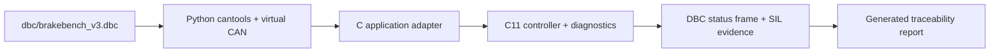

# BrakeBench V3

[](https://github.com/Arnal47/BrakeBench/actions/workflows/ci.yml)

BrakeBench is a small C11 brake ECU reference implementation with a deterministic stdin/stdout runner and Python software-in-the-loop (SIL) tests. It is an engineering exercise, not production vehicle software.

## Behavior

- Converts brake request percentage into hydraulic pressure up to 12,000 kPa.
- Activates ABS when a wheel is below 80% of vehicle speed while braking at speed.
- Reduces pressure by 30% under ABS.
- Fails safe to zero pressure for stale CAN input, invalid brake request, or implausible wheel speed.

## V3 integration architecture



`brakebench_v3.dbc` is the single signal-definition source. It declares IDs 0x180 command, 0x181 wheel speeds, 0x182 pressure feedback and 0x280 status; all have a 20 ms cycle. It also declares units, scale/offset and ranges for BrakeRequest, VehicleSpeed, four WheelSpeed signals, feedback/command pressure, ABS, ECU state, DTC, severity, failsafe, alive counter, checksum and validity.

| DBC message (ID) | Principal signals | Unit / scale / range |
|---|---|---|
| Brake_Command (0x180) | BrakeRequest, VehicleSpeed, AliveCounter, Checksum, Validity | %, 1, 0–100; kph, 0.5, 0–250 |
| Wheel_Speeds (0x181) | FL/FR/RL/RR WheelSpeed, AliveCounter, Checksum, Validity | kph, 0.5, 0–300 |
| Brake_Pressure_Feedback (0x182) | BrakePressureFeedback, AliveCounter, Checksum, Validity | kPa, 1, 0–12000 |
| Brake_ECU_Status (0x280) | BrakePressureCommand, ABS_Active, ECU_State, DTC, Severity, Failsafe, AliveCounter, Checksum, Validity | kPa, 1, 0–12000; enumerations / bool |

The C application adapter accepts decoded signals only; transport, DBC handling, virtual CAN and fault injection remain in Python. This preserves controller/diagnostic isolation.

## Build, test and evidence

```powershell
cmake -S . -B build -G Ninja -DCMAKE_C_COMPILER=clang
cmake --build build
ctest --test-dir build --output-on-failure
py -3 -m pip install -r requirements.txt
$env:BRAKEBENCH_RUNNER = (Resolve-Path build/brake_ecu_runner.exe)
$env:BRAKEBENCH_EVIDENCE = "build/can_evidence.json"
py -3 -m pytest tests/python -q --junitxml=build/pytest.xml
py -3 tools/generate_validation_report.py --junit build/pytest.xml --evidence build/can_evidence.json
```

The report generator produces Markdown, CSV and JSON by joining real JUnit results with runtime virtual-CAN evidence in `reports/`; it does not contain manually entered verdicts or static fault outcomes. See the [requirements](requirements/v3_system_requirements.md), [Validation Test Plan](docs/v3_validation_test_plan.md), and [HARA/DFMEA starter](docs/v3_hara_dfmea_starter.md). These artifacts are educational engineering exercises, **not a production safety case or ISO 26262 compliance claim**.

The runner accepts a CSV input frame: `request,vehicle,wheelFL,wheelFR,wheelRL,wheelRR,timestamp_ms`. Send `TICK,timestamp_ms` to advance time without new CAN input. It emits `STATE`, `ABS`, `FAULT`, and `PRESSURE` fields per line.

## Artifacts

- `dbc/brakebench_v1.dbc`: CAN request and status contract.
- `sim/brakebench_sil.py`: lightweight subprocess SIL client.
- `docs/traceability.md`: requirement-to-test mapping.
- `docs/test_report.md`: verification scope and acceptance record.

## V2 diagnostics

V2 adds a debounced diagnostic state machine. The runner status now exposes `DTC`, `SEVERITY`, and `FAILSAFE` in addition to the legacy state, fault, ABS, and pressure fields. A confirmed failsafe DTC commands zero pressure; a degraded DTC preserves controlled operation.

See [the DTC fault matrix](docs/v2_fault_matrix.md) for detection evidence, confirmation timing, severity, latching, and recovery rules, and [root-cause analysis](docs/v2_root_cause_analysis.md) for the evidence-based SIL reporting method.

`sim/fault_harness.py` turns public runner status into timestamped fault evidence without duplicating C diagnostic logic.
